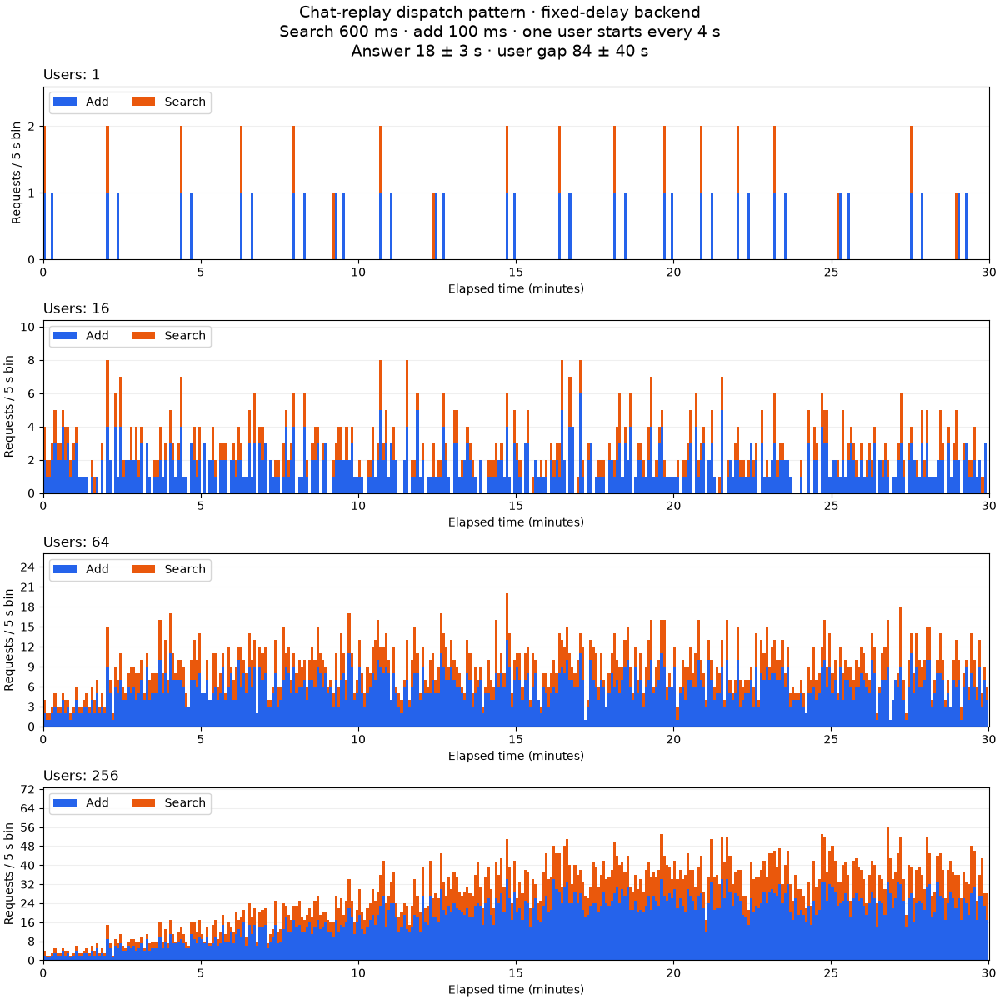
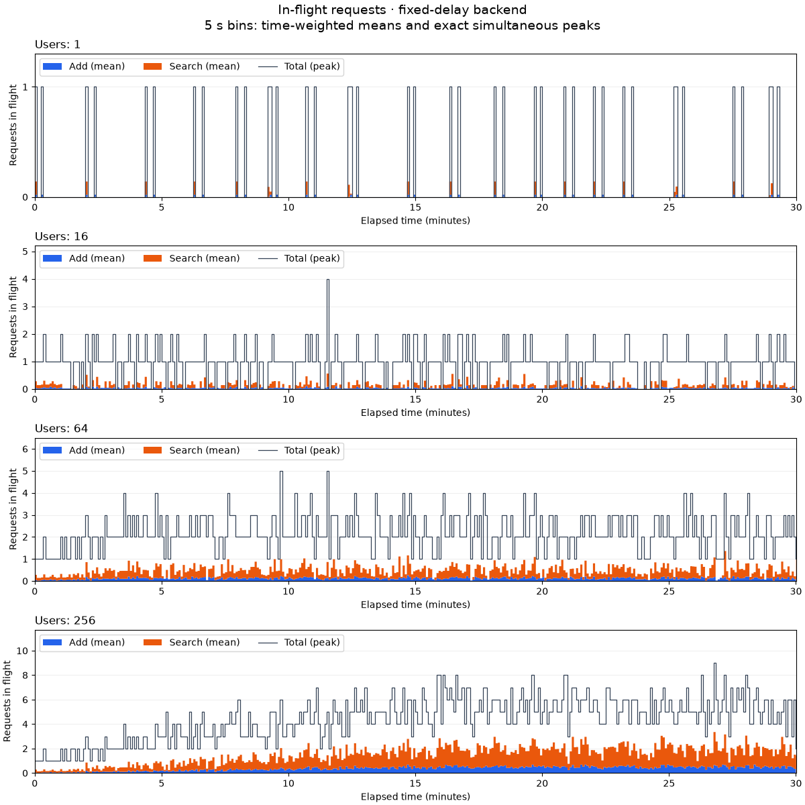
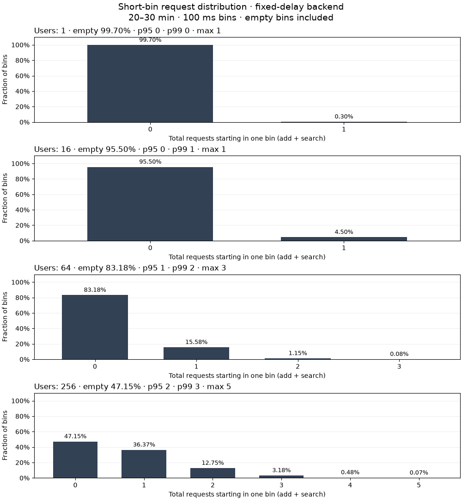

# Workload request patterns

The [fixed-delay example](../examples/workload-patterns/run.py) illustrates
when `chat-replay` sends add and search requests. It uses the existing
`ChatReplay`, `LoadRunner`, and time-series aggregator with an example-only
backend that awaits 600 ms per search and 100 ms per add. Calls wait
independently; there is no server, storage, network, or backend resource cap.
The 100 ms add delay represents an acknowledgement, not completion of any
background ingestion. This is a workload illustration, not an LTM performance
measurement or retrieval-quality test.

## Example conditions

The bundled [preset](../examples/workload-patterns/chat-replay.yaml) runs four
independent closed-model runners concurrently in one asyncio event loop, each
for **30 real minutes**. Every user has one sequential session. Global
concurrency is uncapped, and there is no pre-ingest, warm-up, or extra think
jitter.

| Users | `RunConfig.rampup` | Last user starts |
|---:|---:|---:|
| 1 | 0 s | 0 s |
| 16 | 64 s | 60 s |
| 64 | 256 s | 252 s |
| 256 | 1024 s | 1020 s |

The first user starts immediately and another starts every four seconds.
The 30-minute duration includes ramp-up. In the 256-user case, all users
are active for the final 13 minutes.

- LLM answer delay: bounded Uniform **15–21 seconds** (18 ± 3).
- User reading/typing delay: bounded Uniform **44–124 seconds** (84 ± 40).
- Recall before every user turn, with `top_k=20`.
- Generated dialogue: 128 alternating user/assistant turn pairs per user;
  every turn is one short memory item, so each pair emits search → user add →
  assistant add. The contents are illustrative and are not LongMemEval data.
- Seed: 0; request-count bins: 5 seconds.

The scenario applies answer delay before the assistant add, and user gap
before the next user search. The first user turn has no user gap. These are
the existing scenario semantics. A finite dialogue wraps if exhausted;
the bundled dialogue is long enough not to wrap during this example.
Real datasets can produce a different number of adds when turns are split
into multiple memory items or their roles are not strictly alternating.

## Run and plot

From the repository root, install LTM100 and run the example:

```sh
pip install -e .
python examples/workload-patterns/run.py --output out/workload-patterns
```

All four cases start together and finish in approximately 30 minutes. Time
is not accelerated. Each case is written under `users-N/`; an existing case
directory is rejected to prevent overwriting an earlier run. To change the
conditions, copy the preset and pass `--config PATH` to the example script.
This preset is separate from backend YAMLs accepted by `ltm100 run`.

Graph generation happens only after the workload completes. Its dependency
is optional and does not enter the runner or the normal LTM100 installation:

```sh
pip install -r examples/workload-patterns/requirements.txt
python examples/workload-patterns/plot.py \
    --input out/workload-patterns --output out/workload-patterns/chat-replay.svg
```

Use a `.png` output path to generate a raster image instead.

Each case writes:

| File | Contents |
|---|---|
| `request-counts.csv` | Add/search dispatch counts in each elapsed-time bin, including empty bins |
| `timeseries.csv` | Existing client time-series report with starts, completions, in-flight counts, and latencies |
| `raw.ndjson` | Every operation's start/end time, user, type, and status |
| `summary.json` | Actual run boundaries, complete example parameters, and aggregate results |

The bars count operation **starts**, not completions or in-flight requests.
For this in-process backend, starts correspond to entry into the simulated
add/search calls. Every call is one simulated request; no batching or retries
occur. Final in-flight operations drain after the duration deadline, so the
last CSV bin may be partial and the report window may extend slightly beyond
30 minutes. No new operation starts after the deadline.

Seeded delay draws are reproducible, but real event-loop scheduling can move
requests across bin boundaries. These images should not be interpreted as
exact predictions of a real server's arrival or throughput pattern.

## Recorded example

The image below is generated from the actual 30-minute preset runs. Each
panel uses its own Y scale so the sparse single-user pattern remains visible.
The CSV counts and summaries are retained beside the image for inspection.
The runs use Python 3.12 and the unchanged runner/scenario from upstream
`main` at `6bb86d1`.

| Users | Search requests | Add requests |
|---:|---:|---:|
| 1 | 18 | 36 |
| 16 | 282 | 563 |
| 64 | 1069 | 2128 |
| 256 | 3333 | 6625 |

All 14,054 requests succeeded. Counts include partial turn pairs at the
deadline; pending user/answer delays do not emit an operation after it.
Observed mean latencies were approximately 601 ms for search and 101 ms
for add, including event-loop scheduling overhead.



To redraw the committed example without rerunning the workload:

```sh
python examples/workload-patterns/plot.py \
    --input docs/assets/workload-patterns \
    --output out/workload-patterns-recorded.svg
```

## Concurrency and short-bin bursts

Two additional views use the **same raw records**, without rerunning the
workload or changing its timing. Reconstruct these reports after a run:

```sh
python examples/workload-patterns/analyze.py \
    --input out/workload-patterns --output out/workload-patterns
python examples/workload-patterns/plot.py --kind inflight \
    --input out/workload-patterns --output out/workload-patterns/inflight.png
python examples/workload-patterns/plot.py --kind bursts \
    --input out/workload-patterns --output out/workload-patterns/bursts.png
```

### In-flight requests over the full run

An operation is in flight from its recorded start until its recorded end,
using a half-open interval `[start, end)`. If one operation ends exactly when
another starts, they do not overlap. Rejected operations were not dispatched
and are excluded; dispatched failures still occupy time until completion.

The filled areas show the **time-weighted mean** add/search concurrency in
each 5-second bin. The dark line shows the **actual maximum simultaneous
total** in that bin, computed from individual start/end events. It does not
mean that concurrency stayed at that maximum for all five seconds. Short
requests are retained even when they finish between sampling boundaries.
The combined peak is computed directly, rather than summing add and search
peaks that might occur at different times.



The 256-user run builds up during ramp-up, but its last-10-minute mean is
only **1.968 in-flight requests**, with an observed peak of **9**. Most users
are waiting for an answer or reading/typing, rather than calling the backend.
Virtual-user count therefore differs substantially from request concurrency.

Search contributes **1.473** mean in-flight requests and add contributes
**0.495** in that window. Although adds occur about twice as often, searches
last about six times longer, giving them roughly three times the residence
time. The observed total start rate is **7.368 requests/s**; its mix and fixed
delays explain why mean concurrency is approximately two.

### Requests per 100 ms in the comparison window

For all cases, the histogram uses **20–30 minutes**, after ramp-up and initial
chat starts. Each of its **6,000 non-overlapping 100 ms bins** counts add and
search starts together. Empty bins are included. The histogram measures
short-window dispatch counts, not latency or in-flight concurrency.



| Users | Mean in flight | Peak in flight | Empty 100 ms bins | p99 starts / 100 ms | Maximum starts / 100 ms |
|---:|---:|---:|---:|---:|---:|
| 1 | 0.008 | 1 | 99.70% | 0 | 1 |
| 16 | 0.120 | 2 | 95.50% | 1 | 1 |
| 64 | 0.484 | 4 | 83.18% | 2 | 3 |
| 256 | 1.968 | 9 | 47.15% | 3 | 5 |

All table values use the **20–30-minute window**, whereas the in-flight
figure covers the full run. For one user, p99 is zero because more than 99%
of the bins contain no dispatch; the workload still issued 18 requests in
this window. With 256 users, 47.15% of bins remain empty, while p99 is three
requests per bin and the observed maximum is five. These are percentiles of
**request counts**, not response-time percentiles or a server capacity limit.

The analysis writes `inflight.csv`, `burst-histogram.csv`, and
`pattern-statistics.json` per case. The JSON includes add, search, and combined
statistics, including p95/p99, maxima, and empty-bin fractions. The committed
derived files can redraw both images without raw data: replace `--input` in
the two plotting commands with `docs/assets/workload-patterns`.

`analyze.py` accepts `--inflight-interval`, `--burst-interval`, `--window-start`,
and `--window-end` in seconds. The distribution window must fit inside the
recorded measurement and contain a whole number of burst intervals, avoiding
partial-bin exposure bias. These figures describe one fixed-delay example;
their values depend on the chosen window, bin width, seed, and timing model.
